# CrymbleUI

[](https://github.com/wolfgang371/crymbleui/actions/workflows/ci.yml)
[](https://github.com/wolfgang371/crymbleui/tags)
[](https://crystal-lang.org/)
[](LICENSE)

**Version 0.6.7**

A nice and fast GUI framework for Crystal.
Declarative and reactive.

Its name is a pun of Crystal and nimble :smiley:

Currently with SFML 3.0 backend, for Linux and Windows.
(Windows needed slight patching of SFML, included here)

CrymbleUI is fully AI generated.

Its first line of code emerged 2.11.2025, 19:46.

Currently is has:
- src/: ~29765 LOC
- spec/: ~50821 LOC

## Features

- **Declarative DSL** - Build UIs with a clean, SwiftUI-inspired syntax
- **Reactive State** - Automatic UI updates when state changes
- **Performant** - Uses several internal caching techniques
- **Rich Widget Set** - Buttons, text inputs, checkboxes, combo boxes, scroll views, menus, panels, and more
- **Drag & Drop** - Type-safe drag and drop with accept filtering
- **Keyboard Navigation** - Tab focus, shortcuts, and accessibility support
- **VirtualMatrix widget** (since v0.3.0)
  - arbitrary size matrix
  - arbitrary cell widgets
  - fully flexible automatic sticky headers (both rows and columns, arbitrary nesting)
  - fully flexible automatic cell combination, independent of sticky headers
  - fully transparent internal caching mechanisms to guarantee best performance
  - cell editing, keyboard actions (cut/paste/insert/delete), cell drag-and-drop
  - see tutorial-22.cr (<100LOC) or virtual_matrix_demo.cr
- **Centralized color theme handling** (since v0.3.0)
  - light and dark themes with runtime switching
  - fully user controllable via JSON
  - instance overrides, custom app background color
  - see tutorial-23.cr
- **Image widget** (since v0.4.0) - display PNG/JPG with tinting and alpha
- **TreeNode widget** (since v0.4.0) - collapsible sections for hierarchical content
- **Disabled buttons and menu items** (since v0.4.0) - visual feedback, no click handling
- **Right-click context menus** - handler bubbling up the widget tree
- **Window title sync** - dynamic window title from root widget

## Installation

Add to your `shard.yml`:

```yaml
dependencies:
  crymble-ui:
    github: wolfgang371/crymbleui
```

Then run:

```bash
shards install
```

## Quick Start

In `src/hello.cr`:

```crystal
require "crymble-ui"

class HelloApp < CrymbleUI::App
  def build : CrymbleUI::Widget
    window("Hello", 400, 200) do
      text("Hello, CrymbleUI!")
    end
  end
end

CrymbleUI.run(HelloApp.new)
```

Then run:

```bash
source lib/crymble-ui/setup.sh
crystal run src/hello.cr
```

## Examples

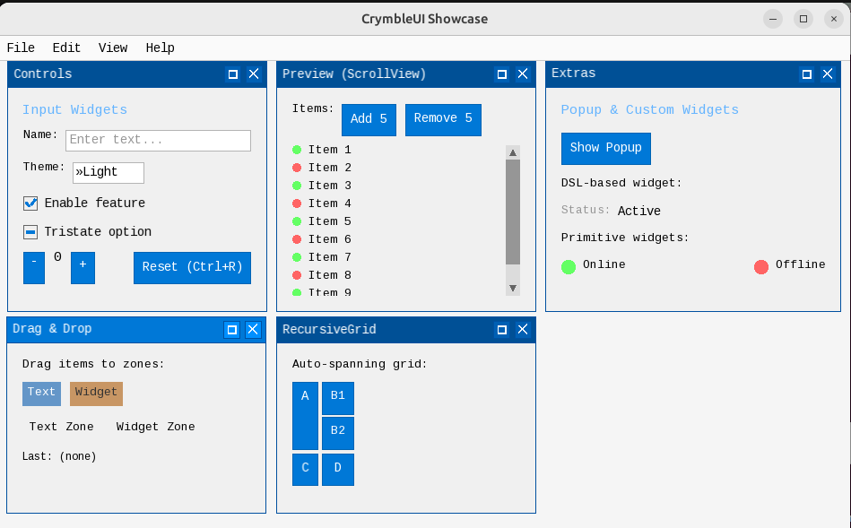

and many more in examples/

## New Features

### v0.5.0

#### Tutorial 26: FlowLayout
Wrap-aware horizontal layout. Arranges children left-to-right and

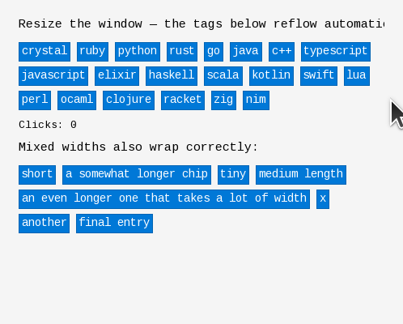

<details>
<summary>View source code</summary>

```crystal
require "../src/crymble-ui"

include CrymbleUI

class Tutorial26App < CrymbleUI::App
  state check_count : Int32 = 0

  TAGS = %w(
    crystal ruby python rust go java c++ typescript javascript elixir haskell
    scala kotlin swift lua perl ocaml clojure racket zig nim
  )

  def build : CrymbleUI::Widget
    window("Tutorial 26: FlowLayout", 600, 400) do
      vstack(padding: 15.0, spacing: 12.0) do
        text("Resize the window — the tags below reflow automatically.", font_scale: 1)

        # Plain flow of buttons. No chunking, no max-per-row — the flow
        # measures each child against the available width and wraps as needed.
        flow(hspacing: 8.0, vspacing: 6.0) do
          TAGS.each do |tag|
            button(tag, padding: 4.0) { self.check_count += 1 }
          end
        end

        text("Clicks: #{check_count}", font_scale: -1)

        text("Mixed widths also wrap correctly:", font_scale: 1)
        flow(hspacing: 8.0, vspacing: 6.0) do
          [
            "short",
            "a somewhat longer chip",
            "tiny",
            "medium length",
            "an even longer one that takes a lot of width",
            "x",
            "another",
            "final entry"
          ].each do |s|
            button(s, padding: 4.0) { }
          end
        end
      end
    end
  end
end

CrymbleUI.run(Tutorial26App.new)
```

</details>

---
### v0.4.0

#### Tutorial 24: Image Widget
Displaying images with tinting and sizing options.

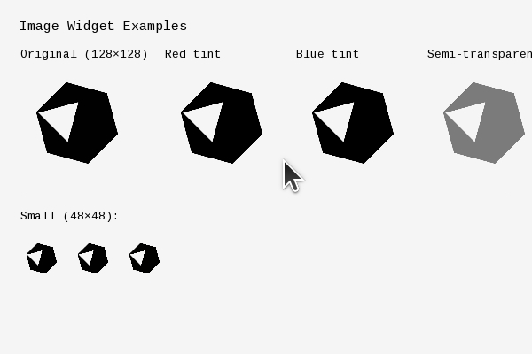

<details>
<summary>View source code</summary>

```crystal
require "../src/crymble-ui"

include CrymbleUI

class Tutorial24App < CrymbleUI::App
  LOGO = "tutorials/crystal_logo.png"

  def build : CrymbleUI::Widget
    window("Tutorial 24: Image Widget", 600, 400) do
      vstack(padding: 15.0, spacing: 15.0) do
        text("Image Widget Examples", font_scale: 1)

        hstack(spacing: 20.0) do
          vstack(spacing: 5.0) do
            text("Original (128×128)", font_scale: -1)
            image(LOGO, width: 128.0, height: 128.0)
          end

          vstack(spacing: 5.0) do
            text("Red tint", font_scale: -1)
            image(LOGO, width: 128.0, height: 128.0,
                  tint: Color.new(255, 100, 100, 255))
          end

          vstack(spacing: 5.0) do
            text("Blue tint", font_scale: -1)
            image(LOGO, width: 128.0, height: 128.0,
                  tint: Color.new(100, 100, 255, 255))
          end

          vstack(spacing: 5.0) do
            text("Semi-transparent", font_scale: -1)
            image(LOGO, width: 128.0, height: 128.0,
                  tint: Color.new(255, 255, 255, 128))
          end
        end

        separator

        text("Small (48×48):", font_scale: -1)
        hstack(spacing: 10.0) do
          image(LOGO, width: 48.0, height: 48.0)
          image(LOGO, width: 48.0, height: 48.0, tint: Color.new(100, 255, 100, 255))
          image(LOGO, width: 48.0, height: 48.0, tint: Color.new(255, 200, 50, 255))
        end
      end
    end
  end
end

CrymbleUI.run(Tutorial24App.new)
```

</details>

---
#### Tutorial 25: TreeNode
Collapsible tree sections for hierarchical content.

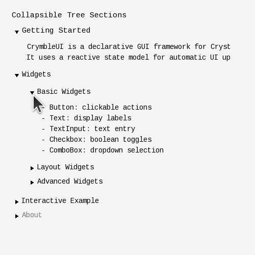

<details>
<summary>View source code</summary>

```crystal
require "../src/crymble-ui"

include CrymbleUI

class Tutorial25App < CrymbleUI::App
  state click_count : Int32 = 0

  def build : CrymbleUI::Widget
    window("Tutorial 25: TreeNode", 500, 500) do
      vstack(padding: 15.0, spacing: 10.0) do
        text("Collapsible Tree Sections", font_scale: 1)

        expanded do scroll_view(direction: ScrollDirection::Vertical) do
          vstack(spacing: 4.0) do
            tree_node("Getting Started", expanded: true, font_scale: 1) do
              vstack(padding: 10.0, spacing: 5.0) do
                text("CrymbleUI is a declarative GUI framework for Crystal.")
                text("It uses a reactive state model for automatic UI updates.")
              end
            end

            tree_node("Widgets", expanded: true) do
              vstack(padding: 10.0, spacing: 4.0) do
                tree_node("Basic Widgets", expanded: true) do
                  vstack(padding: 10.0, spacing: 5.0) do
                    text("- Button: clickable actions")
                    text("- Text: display labels")
                    text("- TextInput: text entry")
                    text("- Checkbox: boolean toggles")
                    text("- ComboBox: dropdown selection")
                  end
                end

                tree_node("Layout Widgets") do
                  vstack(padding: 10.0, spacing: 5.0) do
                    text("- VStack: vertical arrangement")
                    text("- HStack: horizontal arrangement")
                    text("- Expanded: fill remaining space")
                    text("- ScrollView: scrollable content")
                    text("- RecursiveGrid: auto-spanning grids")
                  end
                end

                tree_node("Advanced Widgets") do
                  vstack(padding: 10.0, spacing: 5.0) do
                    text("- VirtualMatrix: large scrollable tables")
                    text("- WindowPanel: floating panels")
                    text("- TreeNode: collapsible sections (this!)")
                    text("- Image: display images")
                  end
                end
              end
            end

            tree_node("Interactive Example") do
              vstack(padding: 10.0, spacing: 8.0) do
                text("Buttons work inside tree nodes:")
                hstack(spacing: 10.0) do
                  button("Click me") { self.click_count += 1 }
                  text("Clicked: #{click_count} times")
                end
              end
            end

            tree_node("About", text_color: Color.new(150, 150, 150, 255)) do
              vstack(padding: 10.0, spacing: 5.0) do
                text("CrymbleUI v#{`shards version`.chomp}", font_scale: -1,
                     color: Color.new(150, 150, 150, 255))
              end
            end
          end
        end end
      end
    end
  end
end

CrymbleUI.run(Tutorial25App.new)
```

</details>

---
### v0.3.0

#### Tutorial 22: VirtualMatrix
VirtualMatrix widget with arbitrary sized matrix, arbitrary cell widgets and fully flexible automatic sticky headers

https://github.com/user-attachments/assets/6d237ce3-f7b2-49c7-aed8-9b40cf9d04cc

<details>
<summary>View source code</summary>

```crystal
require "../src/crymble-ui"
include CrymbleUI
include CrymbleUI::Widgets::VirtualMatrix

class TutorialAdapter
  include MatrixAdapter

  @total_rows : Int32
  @total_cols : Int32
  @data : Hash(Tuple(Int32, Int32), String)
  property on_button_click : Proc(Nil) = ->{ }

  def initialize(@data_rows : Int32, @data_cols : Int32)
    @total_rows = 2 + @data_rows
    @total_cols = 2 + @data_cols
    @data = Hash(Tuple(Int32, Int32), String).new { |h, k| h[k] = default_value(k[0], k[1]) }
  end
  def get_scrollorder : {Array(Int32), Array(Int32)}
    {(2...@total_rows).to_a + [1, 0], (2...@total_cols).to_a + [1, 0]}
  end
  def get_sizes : {Array(Float64), Array(Float64)}
    {Array.new(@total_rows) { |r| r < 2 ? 1.5 : 1.0 }, Array.new(@total_cols) { |c| c < 2 ? 3.0 : 5.0 }}
  end

  def cell_get_bounding_box(row : Int32, col : Int32) : Tuple(Tuple(Int32, Int32), Tuple(Int32, Int32))
    if row < 2 && col < 2
      { {row, 0}, {row, 1} }
    elsif col < 2 && row >= 2
      span = col == 0 ? 4 : 2
      start = 2 + ((row - 2) // span) * span
      { {start, col}, {start + span - 1, col} }
    elsif row < 2 && col >= 2
      span = row == 0 ? 4 : 2
      start = 2 + ((col - 2) // span) * span
      { {row, start}, {row, start + span - 1} }
    else
      { {row, col}, {row, col} }
    end
  end

  def cell_paint(row : Int32, col : Int32) : CrymbleUI::Widget
    white = Color.new(255, 255, 255, 255)
    return Text.new(@data[{row, col}], background_color: white, padding: 4.0) if row < 2 && col < 2
    return Text.new(@data[{row, col}], color: Color.new(60, 90, 180, 255), background_color: white, padding: 4.0) if col < 2
    return Text.new(@data[{row, col}], color: Color.new(180, 100, 40, 255), background_color: white, padding: 4.0) if row < 2
    return Checkbox.new("Check", background_color: white) if row == 10 && col == 5
    return Button.new("Click") { @on_button_click.call } if row == 11 && col == 5
    TextInput.new(value: @data[{row, col}], mode: TextInputMode::QuickEntry) { |v| @data[{row, col}] = v }
  end

  private def default_value(row : Int32, col : Int32) : String
    return "" if row < 2 && col < 2
    return "r#{col + 1}#{idx_letter((row - 2) // (col == 0 ? 4 : 2))}" if col < 2
    return "c#{row + 1}#{idx_letter((col - 2) // (row == 0 ? 4 : 2))}" if row < 2
    "(#{row - 2},#{col - 2})"
  end

  private def idx_letter(i : Int32) : String; r = "a"; i.times { r = r.succ }; r; end
end

class Tutorial22App < CrymbleUI::App
  state grid_size : Int32 = 100
  state checked : Bool = false
  @adapter : TutorialAdapter?
  @prev_size : Int32?

  def build : CrymbleUI::Widget
    if @prev_size != grid_size
      @prev_size = grid_size
      @adapter = TutorialAdapter.new(grid_size, grid_size)
    end
    adapter = @adapter.not_nil!
    adapter.on_button_click = ->{ self.checked = !checked }

    window("Tutorial 22: VirtualMatrix + Sticky Headers", 900, 600) do
      aligned_layer(align: Alignment::TopRight, margin: 10.0, z_index: 100) { cpu_monitor }
      vstack(padding: 10.0, spacing: 5.0) do
        text("Grid: #{grid_size}×#{grid_size} data cells, 2 sticky row + 2 sticky col headers")
        hstack(spacing: 10.0) do
          [100, 1000, 10000].each { |s| button("#{s}²") { self.grid_size = s } }
          checkbox("Toggled by grid button", checked: checked) { }
        end
        expanded do
          widget(CrymbleUI::VirtualMatrix.new(adapter: adapter, id: "matrix",
            content_background_color: Color.new(200, 200, 205, 255),
            cursor_highlight_delta: -40))
        end
      end
    end
  end
end

CrymbleUI.run(Tutorial22App.new)
```

</details>

---
#### Tutorial 23: Color Themes
Demonstrates runtime theme switching, custom app background color, and disabled buttons.

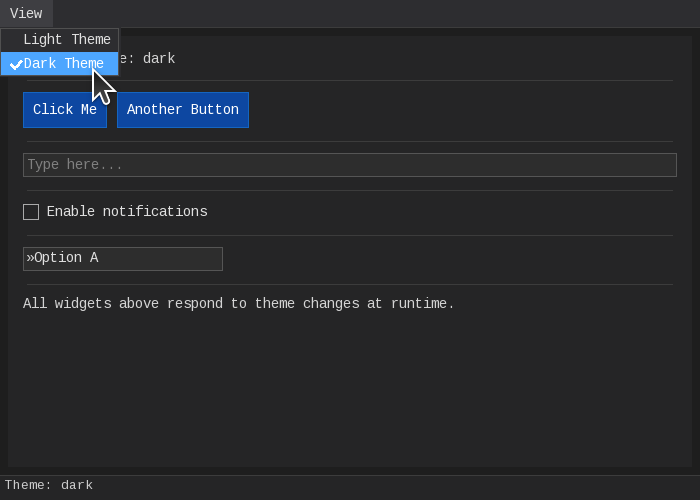

<details>
<summary>View source code</summary>

```crystal
require "../src/crymble-ui"

include CrymbleUI

class Tutorial23App < CrymbleUI::App
  state current_theme : Symbol = :light
  state notify : Bool = false
  state input_value : String = ""
  state bg_mode : Symbol = :theme  # :theme, :green, :blue

  # Custom window background color based on bg_mode
  def app_background_color : CrymbleUI::Color?
    case @bg_mode
    when :green then Color.new(0, 40, 0, 255)
    when :blue  then Color.new(0, 0, 40, 255)
    else             nil # use theme default
    end
  end

  def build : CrymbleUI::Widget
    window("Tutorial 23: Theme Switcher", 700, 550) do
      menubar do
        menu("View") do
          menu_item("Light Theme", checked: current_theme == :light, checkable: true) do
            Theme.set(:light)
            self.current_theme = :light
          end
          menu_item("Dark Theme", checked: current_theme == :dark, checkable: true) do
            Theme.set(:dark)
            self.current_theme = :dark
          end
          separator
          menu_item("Background: Theme Default", checked: bg_mode == :theme, checkable: true) do
            self.bg_mode = :theme
          end
          menu_item("Background: Dark Green", checked: bg_mode == :green, checkable: true) do
            self.bg_mode = :green
          end
          menu_item("Background: Dark Blue", checked: bg_mode == :blue, checkable: true) do
            self.bg_mode = :blue
          end
        end
      end

      vstack(padding: 15.0, spacing: 10.0, background_color: Theme.current.panel_background) do
        text("Current theme: #{current_theme}, background: #{bg_mode}")

        separator

        hstack(spacing: 10.0) do
          button("Click Me") { }
          button("Another Button") { }
          b = button("Disabled") { }
          b.enabled = false
        end

        separator

        text_input(value: input_value, placeholder: "Type here...") { |v| self.input_value = v }

        separator

        checkbox("Enable notifications", bind: notify)

        separator

        combo_box(items: ["Option A", "Option B", "Option C"], width: 200.0)

        separator

        text("Disabled buttons appear greyed out and don't respond to clicks.")
        text("Custom backgrounds are set via app_background_color override.")
        text("Try View menu to switch theme and background.")
      end

      statusbar("Theme: #{current_theme} | Background: #{bg_mode}")
    end
  end
end

CrymbleUI.run(Tutorial23App.new)
```

</details>

---
## Tutorials
### Tutorial 01: Hello World
The simplest CrymbleUI application.

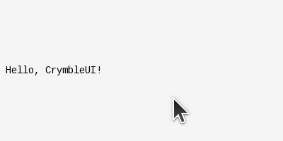

<details>
<summary>View source code</summary>

```crystal
require "../src/crymble-ui"

class HelloWorld < CrymbleUI::App
  def build : CrymbleUI::Widget
    window("Hello World", 400, 200) do
      text("Hello, CrymbleUI!")
    end
  end
end

CrymbleUI.run(HelloWorld.new)
```

</details>

---
### Tutorial 02: Button
Buttons with click events.

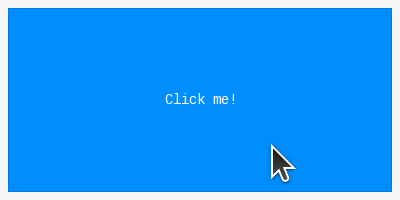

<details>
<summary>View source code</summary>

```crystal
require "../src/crymble-ui"

class ButtonDemo < CrymbleUI::App
  def build : CrymbleUI::Widget
    window("Button Demo", 400, 200) do
      button("Click me!") do
        puts "Button was clicked!"
      end
    end
  end
end

CrymbleUI.run(ButtonDemo.new)
```

</details>

---
### Tutorial 03: VStack Layout
Vertical stacking of widgets.

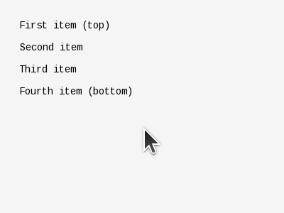

<details>
<summary>View source code</summary>

```crystal
require "../src/crymble-ui"

class VStackDemo < CrymbleUI::App
  def build : CrymbleUI::Widget
    window("VStack Demo", 400, 300) do
      vstack(spacing: 15.0, padding: 20.0) do
        text("First item (top)")
        text("Second item")
        text("Third item")
        text("Fourth item (bottom)")
      end
    end
  end
end

CrymbleUI.run(VStackDemo.new)
```

</details>

---
### Tutorial 04: HStack Layout
Horizontal stacking of widgets.

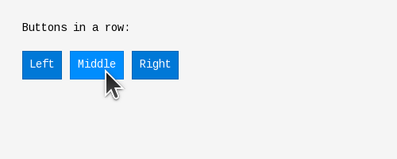

<details>
<summary>View source code</summary>

```crystal
require "../src/crymble-ui"

class HStackDemo < CrymbleUI::App
  def build : CrymbleUI::Widget
    window("HStack Demo", 500, 200) do
      vstack(spacing: 20.0, padding: 20.0) do
        text("Buttons in a row:")

        hstack(spacing: 10.0) do
          button("Left") { puts "Left clicked" }
          button("Middle") { puts "Middle clicked" }
          button("Right") { puts "Right clicked" }
        end
      end
    end
  end
end

CrymbleUI.run(HStackDemo.new)
```

</details>

---
### Tutorial 05: State Management
Reactive state with automatic UI updates.

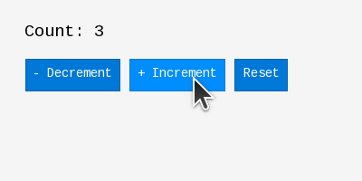

<details>
<summary>View source code</summary>

```crystal
require "../src/crymble-ui"

class CounterApp < CrymbleUI::App
  # Reactive state - UI rebuilds when this changes
  state count : Int32 = 0

  def build : CrymbleUI::Widget
    window("Counter", 400, 200) do
      vstack(spacing: 15.0, padding: 20.0) do
        text("Count: #{count}", font_scale: 3)

        hstack(spacing: 10.0) do
          button("- Decrement") { self.count -= 1 }
          button("+ Increment") { self.count += 1 }
          button("Reset") { self.count = 0 }
        end
      end
    end
  end
end

CrymbleUI.run(CounterApp.new)
```

</details>

---
### Tutorial 06: Checkbox
Boolean toggles and tristate checkboxes.

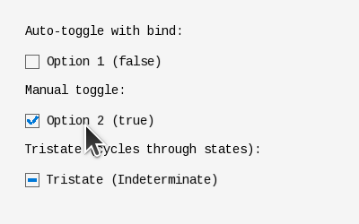

<details>
<summary>View source code</summary>

```crystal
require "../src/crymble-ui"

class CheckboxDemo < CrymbleUI::App
  state option1 : Bool = false
  state option2 : Bool = true
  state tristate : CrymbleUI::CheckState = CrymbleUI::CheckState::Indeterminate

  def build : CrymbleUI::Widget
    window("Checkbox Demo", 400, 250) do
      vstack(spacing: 15.0, padding: 20.0) do
        text("Auto-toggle with bind:")
        checkbox("Option 1 (#{option1})", bind: option1)

        text("Manual toggle:")
        checkbox("Option 2 (#{option2})", checked: option2) do
          self.option2 = !option2
        end

        text("Tristate (cycles through states):")
        checkbox("Tristate (#{tristate})", state: tristate) do
          self.tristate = case tristate
          when CrymbleUI::CheckState::Unchecked     then CrymbleUI::CheckState::Checked
          when CrymbleUI::CheckState::Checked       then CrymbleUI::CheckState::Indeterminate
          when CrymbleUI::CheckState::Indeterminate then CrymbleUI::CheckState::Unchecked
          else CrymbleUI::CheckState::Unchecked
          end
        end
      end
    end
  end
end

CrymbleUI.run(CheckboxDemo.new)
```

</details>

---
### Tutorial 07: TextInput
Single-line text entry fields.

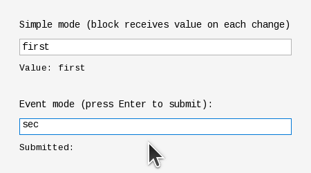

<details>
<summary>View source code</summary>

```crystal
require "../src/crymble-ui"

class TextInputDemo < CrymbleUI::App
  state name : String = ""
  state submitted : String = ""

  def build : CrymbleUI::Widget
    window("TextInput Demo", 450, 250) do
      vstack(spacing: 12.0, padding: 20.0) do
        text("Simple mode (block receives value on each change):")
        text_input(value: name, placeholder: "Type here...") do |value|
          self.name = value
        end
        text("Value: #{name}", font_scale: -1)

        spacer

        text("Event mode (press Enter to submit):")
        text_input(value: submitted, placeholder: "Type and press Enter...",
          on_event: ->(value : String, event : CrymbleUI::TextInputEvent) {
            self.submitted = value if event.submit?
          }
        )
        text("Submitted: #{submitted}", font_scale: -1)
      end
    end
  end
end

CrymbleUI.run(TextInputDemo.new)
```

</details>

---
### Tutorial 08: ComboBox
Dropdown selection lists.

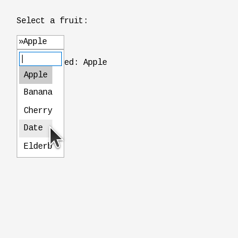

<details>
<summary>View source code</summary>

```crystal
require "../src/crymble-ui"

class ComboBoxDemo < CrymbleUI::App
  state selected_index : Int32 = 0

  FRUITS = ["Apple", "Banana", "Cherry", "Date", "Elderberry"]

  def build : CrymbleUI::Widget
    window("ComboBox Demo", 400, 400) do
      vstack(spacing: 15.0, padding: 20.0) do
        text("Select a fruit:")

        combo_box(items: FRUITS, selected: selected_index) do |index, value|
          self.selected_index = index
          puts "Selected: #{value} (index #{index})"
        end

        text("You selected: #{FRUITS[selected_index]}")
      end
    end
  end
end

CrymbleUI.run(ComboBoxDemo.new)
```

</details>

---
### Tutorial 09: Expanded & Spacer
Filling remaining space in layouts.

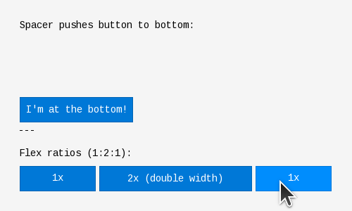

<details>
<summary>View source code</summary>

```crystal
require "../src/crymble-ui"

class ExpandedDemo < CrymbleUI::App
  def build : CrymbleUI::Widget
    window("Expanded Demo", 500, 300) do
      vstack(spacing: 10.0, padding: 20.0) do
        text("Spacer pushes button to bottom:")

        spacer  # Takes all remaining vertical space

        button("I'm at the bottom!") { }

        text("---")
        text("Flex ratios (1:2:1):")

        hstack(spacing: 5.0) do
          expanded(flex: 1) do
            button("1x") { }
          end
          expanded(flex: 2) do
            button("2x (double width)") { }
          end
          expanded(flex: 1) do
            button("1x") { }
          end
        end
      end
    end
  end
end

CrymbleUI.run(ExpandedDemo.new)
```

</details>

---
### Tutorial 10: ScrollView
Scrollable containers for large content.

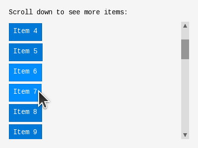

<details>
<summary>View source code</summary>

```crystal
require "../src/crymble-ui"

class ScrollViewDemo < CrymbleUI::App
  def build : CrymbleUI::Widget
    window("ScrollView Demo", 400, 300) do
      vstack(spacing: 10.0, padding: 10.0) do
        text("Scroll down to see more items:")

        expanded do
          scroll_view(direction: CrymbleUI::ScrollDirection::Vertical) do
            vstack(spacing: 5.0) do
              30.times do |i|
                button("Item #{i + 1}") { puts "Clicked item #{i + 1}" }
              end
            end
          end
        end
      end
    end
  end
end

CrymbleUI.run(ScrollViewDemo.new)
```

</details>

---
### Tutorial 11: Styling Widgets
Customizing colors and fonts.

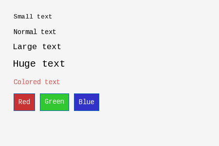

<details>
<summary>View source code</summary>

```crystal
require "../src/crymble-ui"

class StylingDemo < CrymbleUI::App
  def build : CrymbleUI::Widget
    window("Styling Demo", 450, 300) do
      vstack(spacing: 15.0, padding: 20.0) do
        text("Small text", font_scale: -1)
        text("Normal text", font_scale: 0)
        text("Large text", font_scale: 2)
        text("Huge text", font_scale: 4)

        text("Colored text", color: CrymbleUI::Color.new(255, 100, 100, 255))

        hstack(spacing: 10.0) do
          button("Red",
            background_color: CrymbleUI::Color.new(200, 50, 50, 255),
            text_color: CrymbleUI::Color.new(255, 255, 255, 255)) { }

          button("Green",
            background_color: CrymbleUI::Color.new(50, 200, 50, 255),
            text_color: CrymbleUI::Color.new(255, 255, 255, 255)) { }

          button("Blue",
            background_color: CrymbleUI::Color.new(50, 50, 200, 255),
            text_color: CrymbleUI::Color.new(255, 255, 255, 255)) { }
        end
      end
    end
  end
end

CrymbleUI.run(StylingDemo.new)
```

</details>

---
### Tutorial 12: WindowPanel
Floating, draggable, resizable panels.

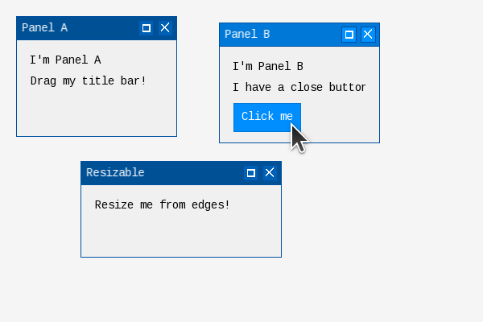

<details>
<summary>View source code</summary>

```crystal
require "../src/crymble-ui"

class WindowPanelDemo < CrymbleUI::App
  def build : CrymbleUI::Widget
    window("WindowPanel Demo", 600, 400) do
      window_panel(title: "Panel A", x: 20.0, y: 20.0, width: 200.0, height: 150.0) do
        vstack(padding: 10.0) do
          text("I'm Panel A")
          text("Drag my title bar!")
        end
      end

      window_panel(title: "Panel B", x: 250.0, y: 50.0, width: 200.0, height: 150.0,
                   closeable: true) do
        vstack(padding: 10.0) do
          text("I'm Panel B")
          text("I have a close button")
          button("Click me") { puts "Panel B button!" }
        end
      end

      window_panel(title: "Resizable", x: 100.0, y: 200.0, width: 250.0, height: 120.0,
                   resizable: true) do
        vstack(padding: 10.0) do
          text("Resize me from edges!")
        end
      end
    end
  end
end

CrymbleUI.run(WindowPanelDemo.new)
```

</details>

---
### Tutorial 13: MenuBar
Application menus with dropdown items.

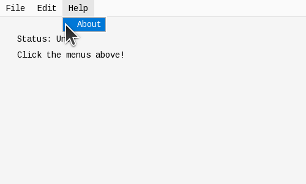

<details>
<summary>View source code</summary>

```crystal
require "../src/crymble-ui"

class MenuBarDemo < CrymbleUI::App
  state status : String = "Ready"

  def build : CrymbleUI::Widget
    window("MenuBar Demo", 500, 300) do
      menubar do
        menu("File") do
          menu_item("New") { self.status = "New file" }
          menu_item("Open") { self.status = "Open file" }
          menu_item("Save") { self.status = "Save file" }
          separator
          menu_item("Quit") { quit }
        end

        menu("Edit") do
          menu_item("Undo") { self.status = "Undo" }
          menu_item("Redo") { self.status = "Redo" }
          separator
          menu_item("Cut") { self.status = "Cut" }
          menu_item("Copy") { self.status = "Copy" }
          menu_item("Paste") { self.status = "Paste" }
        end

        menu("Help") do
          menu_item("About") { self.status = "About CrymbleUI" }
        end
      end

      vstack(padding: 20.0) do
        text("Status: #{status}")
        text("Click the menus above!")
      end
    end
  end
end

CrymbleUI.run(MenuBarDemo.new)
```

</details>

---
### Tutorial 14: Popup & Overlays
Floating popup containers.

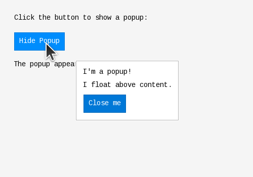

<details>
<summary>View source code</summary>

```crystal
require "../src/crymble-ui"

class PopupDemo < CrymbleUI::App
  state show_popup : Bool = false

  def build : CrymbleUI::Widget
    window("Popup Demo", 500, 350) do
      vstack(spacing: 20.0, padding: 20.0) do
        text("Click the button to show a popup:")

        button(show_popup ? "Hide Popup" : "Show Popup") do
          self.show_popup = !show_popup
        end

        text("The popup appears as an overlay.")
      end

      if show_popup
        popup(x: 150.0, y: 120.0, padding: 15.0) do
          vstack(spacing: 10.0) do
            text("I'm a popup!")
            text("I float above content.")
            button("Close me") { self.show_popup = false }
          end
        end
      end
    end
  end
end

CrymbleUI.run(PopupDemo.new)
```

</details>

---
### Tutorial 15: StatusBar
Information display at window bottom.

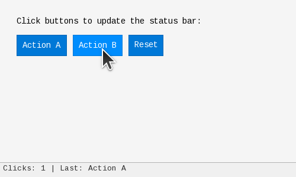

<details>
<summary>View source code</summary>

```crystal
require "../src/crymble-ui"

class StatusBarDemo < CrymbleUI::App
  state click_count : Int32 = 0
  state last_action : String = "Ready"

  def build : CrymbleUI::Widget
    window("StatusBar Demo", 500, 300) do
      vstack(spacing: 15.0, padding: 20.0) do
        text("Click buttons to update the status bar:")

        hstack(spacing: 10.0) do
          button("Action A") do
            self.click_count += 1
            self.last_action = "Action A"
          end

          button("Action B") do
            self.click_count += 1
            self.last_action = "Action B"
          end

          button("Reset") do
            self.click_count = 0
            self.last_action = "Reset"
          end
        end

        spacer
      end

      statusbar(text: "Clicks: #{click_count} | Last: #{last_action}")
    end
  end
end

CrymbleUI.run(StatusBarDemo.new)
```

</details>

---
### Tutorial 16: Keyboard Focus
Tab navigation between focusable widgets.

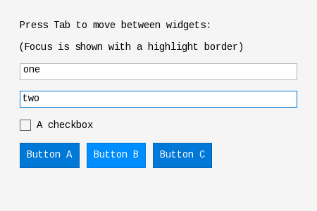

<details>
<summary>View source code</summary>

```crystal
require "../src/crymble-ui"

class FocusDemo < CrymbleUI::App
  state value1 : String = ""
  state value2 : String = ""
  state checked : Bool = false

  def build : CrymbleUI::Widget
    window("Focus Demo", 450, 300) do
      vstack(spacing: 15.0, padding: 20.0) do
        text("Press Tab to move between widgets:")
        text("(Focus is shown with a highlight border)")

        text_input(value: value1, placeholder: "First input") do |val|
          self.value1 = val
        end

        text_input(value: value2, placeholder: "Second input") do |val|
          self.value2 = val
        end

        checkbox("A checkbox", checked: checked) do
          self.checked = !checked
        end

        hstack(spacing: 10.0) do
          button("Button A") { puts "A pressed" }
          button("Button B") { puts "B pressed" }
          button("Button C") { puts "C pressed" }
        end
      end
    end
  end
end

CrymbleUI.run(FocusDemo.new)
```

</details>

---
### Tutorial 17: Keyboard Shortcuts
Explicit shortcuts on widgets and built-in framework shortcuts.

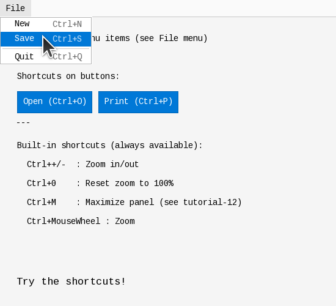

<details>
<summary>View source code</summary>

```crystal
require "../src/crymble-ui"

class ShortcutsDemo < CrymbleUI::App
  state message : String = "Try the shortcuts!"

  def build : CrymbleUI::Widget
    window("Shortcuts Demo", 550, 500) do
      menubar do
        menu("File") do
          menu_item("New", shortcut: "^N") { self.message = "New (Ctrl+N)" }
          menu_item("Save", shortcut: "^S") { self.message = "Save (Ctrl+S)" }
          separator
          menu_item("Quit", shortcut: "^Q") { quit }
        end
      end

      vstack(spacing: 15.0, padding: 20.0) do
        text("Shortcuts on menu items (see File menu)")

        text("---")
        text("Shortcuts on buttons:")

        hstack(spacing: 10.0) do
          button("Open", shortcut: "^O") do
            self.message = "Open (Ctrl+O)"
          end

          button("Print", shortcut: "^P") do
            self.message = "Print (Ctrl+P)"
          end
        end

        text("---")
        text("Built-in shortcuts (always available):")
        text("  Ctrl++/-  : Zoom in/out")
        text("  Ctrl+0    : Reset zoom to 100%")
        text("  Ctrl+M    : Maximize panel (see tutorial-12)")
        text("  Ctrl+MouseWheel : Zoom")

        spacer

        text(message, font_scale: 2)
      end
    end
  end
end

CrymbleUI.run(ShortcutsDemo.new)
```

</details>

---
### Tutorial 18: RecursiveGrid
2D grid layout with array-based DSL.

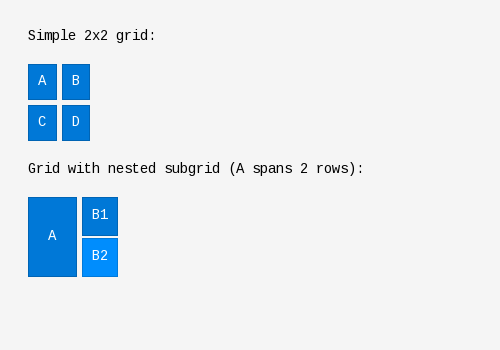

<details>
<summary>View source code</summary>

```crystal
require "../src/crymble-ui"

class RecursiveGridDemo < CrymbleUI::App
  def build : CrymbleUI::Widget
    window("RecursiveGrid Demo", 500, 350) do
      vstack(spacing: 20.0, padding: 20.0) do
        text("Simple 2x2 grid:")

        recursive_grid(spacing: 5.0) do
          [
            [button("A") { }, button("B") { }],
            [button("C") { }, button("D") { }]
          ]
        end

        text("Grid with nested subgrid (A spans 2 rows):")

        recursive_grid(spacing: 5.0) do
          [
            [button("A", padding: 20.0) { },
             recursive_grid(spacing: 3.0) {
               [
                 [button("B1") { }],
                 [button("B2") { }]
               ]
             }]
          ]
        end
      end
    end
  end
end

CrymbleUI.run(RecursiveGridDemo.new)
```

</details>

---
### Tutorial 19: Drag and Drop
Type-safe drag and drop with accept_types filtering.

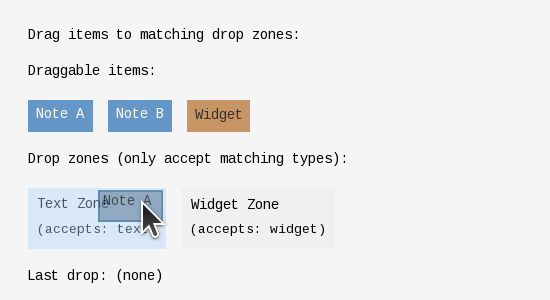

<details>
<summary>View source code</summary>

```crystal
require "../src/crymble-ui"

class DragDropDemo < CrymbleUI::App
  state last_drop : String = "(none)"

  def build : CrymbleUI::Widget
    window("Drag & Drop Demo", 550, 300) do
      vstack(spacing: 20.0, padding: 20.0) do
        text("Drag items to matching drop zones:")

        text("Draggable items:")
        hstack(spacing: 15.0) do
          # Text items (type: "text")
          draggable(data: CrymbleUI::TextDragData.new("Note A")) do
            hstack(padding: 8.0, background_color: CrymbleUI::Color.new(100, 150, 200, 255)) do
              text("Note A", color: CrymbleUI::Color.new(255, 255, 255, 255))
            end
          end

          draggable(data: CrymbleUI::TextDragData.new("Note B")) do
            hstack(padding: 8.0, background_color: CrymbleUI::Color.new(100, 150, 200, 255)) do
              text("Note B", color: CrymbleUI::Color.new(255, 255, 255, 255))
            end
          end

          # Widget items (type: "widget") - using a button as the widget reference
          draggable(data: CrymbleUI::WidgetDragData.new(CrymbleUI::Button.new("Item"))) do
            hstack(padding: 8.0, background_color: CrymbleUI::Color.new(200, 150, 100, 255)) do
              text("Widget", color: CrymbleUI::Color.new(50, 50, 50, 255))
            end
          end
        end

        text("Drop zones (only accept matching types):")
        hstack(spacing: 15.0) do
          # Only accepts "text" type
          drop_zone(accept_types: ["text"], on_drop: ->(data : CrymbleUI::DragData, pos : CrymbleUI::Vec2) {
            self.last_drop = "Text zone: #{data.display_text}"
          }) do
            vstack(padding: 10.0) do
              text("Text Zone")
              text("(accepts: text)", font_scale: -1)
            end
          end

          # Only accepts "widget" type
          drop_zone(accept_types: ["widget"], on_drop: ->(data : CrymbleUI::DragData, pos : CrymbleUI::Vec2) {
            self.last_drop = "Widget zone: #{data.display_text}"
          }) do
            vstack(padding: 10.0) do
              text("Widget Zone")
              text("(accepts: widget)", font_scale: -1)
            end
          end
        end

        text("Last drop: #{last_drop}")
      end
    end
  end
end

CrymbleUI.run(DragDropDemo.new)
```

</details>

---
### Tutorial 20: Layers and Alignment
Floating overlays with automatic positioning.

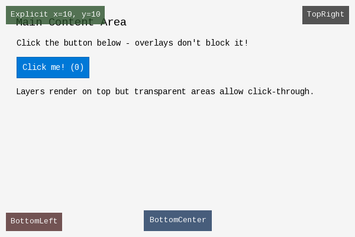

<details>
<summary>View source code</summary>

```crystal
require "../src/crymble-ui"

class LayersDemo < CrymbleUI::App
  state click_count : Int32 = 0

  def build : CrymbleUI::Widget
    window("Layers Demo", 600, 400) do
      # Main content (z_index 0 by default)
      vstack(spacing: 15.0, padding: 20.0) do
        text("Main Content Area", font_scale: 3)
        text("Click the button below - overlays don't block it!")

        button("Click me! (#{click_count})") do
          self.click_count += 1
        end

        text("Layers render on top but transparent areas allow click-through.")
      end

      # =================================================================
      # Example 1: aligned_layer with TopRight (common pattern for HUDs)
      # =================================================================
      aligned_layer(align: CrymbleUI::Alignment::TopRight, margin: 10.0, z_index: 100) do
        hstack(padding: 8.0, background_color: CrymbleUI::Color.new(50, 50, 50, 200)) do
          text("TopRight", font_scale: -1, color: CrymbleUI::Color.new(255, 255, 255, 255))
        end
      end

      # =================================================================
      # Example 2: aligned_layer with BottomLeft
      # =================================================================
      aligned_layer(align: CrymbleUI::Alignment::BottomLeft, margin: 10.0, z_index: 100) do
        hstack(padding: 8.0, background_color: CrymbleUI::Color.new(100, 50, 50, 200)) do
          text("BottomLeft", font_scale: -1, color: CrymbleUI::Color.new(255, 255, 255, 255))
        end
      end

      # =================================================================
      # Example 3: Center-aligned layer (auto-sized to content)
      # =================================================================
      aligned_layer(
        align: CrymbleUI::Alignment::BottomCenter,
        margin: 10.0,
        z_index: 50
      ) do
        hstack(padding: 10.0, background_color: CrymbleUI::Color.new(50, 80, 120, 220)) do
          text("BottomCenter", font_scale: -1, color: CrymbleUI::Color.new(255, 255, 255, 255))
        end
      end

      # =================================================================
      # Example 4: Basic layer() with explicit position
      # =================================================================
      layer(x: 10.0, y: 10.0, z_index: 200) do
        hstack(padding: 8.0, background_color: CrymbleUI::Color.new(50, 100, 50, 200)) do
          text("Explicit x=10, y=10", font_scale: -1, color: CrymbleUI::Color.new(255, 255, 255, 255))
        end
      end
    end
  end
end

CrymbleUI.run(LayersDemo.new)
```

</details>

---
### Tutorial 21: Custom Widgets
Creating custom widget classes using DSL composition.

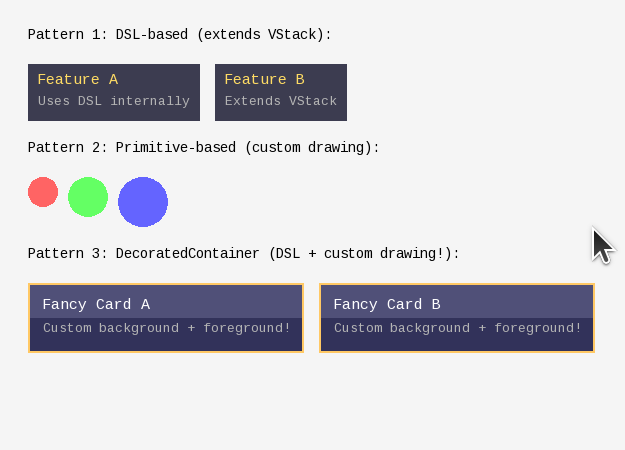

<details>
<summary>View source code</summary>

```crystal
require "../src/crymble-ui"

# =============================================================================
# PATTERN 1: DSL-based custom widget (simple containers)
# =============================================================================
# Extend a container and use DSL in build() to compose children.
# This is the main pattern for creating reusable UI components.

class InfoCard < CrymbleUI::VStack
  def initialize(@title : String, @description : String)
    super(spacing: 5.0, padding: 10.0,
          background_color: CrymbleUI::Color.new(60, 60, 80, 255))
  end

  def build
    text(@title, font_scale: 1, color: CrymbleUI::Color.new(255, 220, 100, 255))
    text(@description, font_scale: -1, color: CrymbleUI::Color.new(180, 180, 180, 255))
  end
end

# =============================================================================
# PATTERN 2: Primitive-based custom widget (pure custom drawing)
# =============================================================================
# For widgets that need custom rendering (shapes, charts, etc.)

class ColoredCircle < CrymbleUI::Widget
  include CrymbleUI::PrimitiveBuilder

  property radius : Float64
  property color : CrymbleUI::Color

  def initialize(@radius = 20.0, @color = CrymbleUI::Color.new(100, 150, 255, 255))
    super()
  end

  def measure(constraints : CrymbleUI::BoxConstraints) : CrymbleUI::Size
    CrymbleUI::Size.new(@radius * 2, @radius * 2)
  end

  def perform_layout(constraints : CrymbleUI::BoxConstraints, position : CrymbleUI::Vec2)
    @bounds = CrymbleUI::Rect.new(position, measure(constraints))
  end

  def to_primitives(bounds : CrymbleUI::Rect) : Array(CrymbleUI::DrawPrimitive)
    primitives do
      draw_circle(CrymbleUI::Vec2.new(bounds.width / 2, bounds.height / 2), @radius, @color, fill: true)
    end
  end
end

# =============================================================================
# PATTERN 3: DecoratedContainer (DSL + custom drawing combined!)
# =============================================================================
# Use DecoratedContainer to have BOTH:
# - DSL children via build()
# - Custom primitives via draw_background() and draw_foreground()
#
# Rendering order:
# 1. draw_background() renders UNDER children
# 2. Children render on top
# 3. draw_foreground() renders OVER everything

class FancyCard < CrymbleUI::DecoratedContainer
  def initialize(@title : String)
    super(padding: 15.0, spacing: 8.0)
  end

  # Custom background: gradient-like effect with two colors
  def draw_background(bounds : CrymbleUI::Rect) : Array(CrymbleUI::DrawPrimitive)
    primitives do
      # Top half: lighter
      fill_rect(CrymbleUI::Rect.new(0, 0, bounds.width, bounds.height / 2),
                CrymbleUI::Color.new(80, 80, 120, 255))
      # Bottom half: darker
      fill_rect(CrymbleUI::Rect.new(0, bounds.height / 2, bounds.width, bounds.height / 2),
                CrymbleUI::Color.new(50, 50, 90, 255))
    end
  end

  # Custom foreground: gold border on top of everything
  def draw_foreground(bounds : CrymbleUI::Rect) : Array(CrymbleUI::DrawPrimitive)
    primitives do
      draw_rect(bounds, CrymbleUI::Color.new(255, 200, 100, 255), 2.0)
    end
  end

  # DSL children: text widgets positioned normally
  def build
    text(@title, font_scale: 1, color: CrymbleUI::Color.new(255, 255, 255, 255))
    text("Custom background + foreground!", font_scale: -1, color: CrymbleUI::Color.new(180, 180, 180, 255))
  end
end

# =============================================================================
# App using all three custom widget patterns
# =============================================================================

class CustomWidgetDemo < CrymbleUI::App
  def build : CrymbleUI::Widget
    window("Custom Widget Demo", 550, 450) do
      vstack(spacing: 20.0, padding: 20.0) do
        text("Pattern 1: DSL-based (extends VStack):")
        hstack(spacing: 15.0) do
          widget InfoCard.new("Feature A", "Uses DSL internally")
          widget InfoCard.new("Feature B", "Extends VStack")
        end

        text("Pattern 2: Primitive-based (custom drawing):")
        hstack(spacing: 10.0) do
          widget ColoredCircle.new(radius: 15.0, color: CrymbleUI::Color.new(255, 100, 100, 255))
          widget ColoredCircle.new(radius: 20.0, color: CrymbleUI::Color.new(100, 255, 100, 255))
          widget ColoredCircle.new(radius: 25.0, color: CrymbleUI::Color.new(100, 100, 255, 255))
        end

        text("Pattern 3: DecoratedContainer (DSL + custom drawing!):")
        hstack(spacing: 15.0) do
          widget FancyCard.new("Fancy Card A")
          widget FancyCard.new("Fancy Card B")
        end
      end
    end
  end
end

CrymbleUI.run(CustomWidgetDemo.new)
```

</details>

---
### Tutorial 22: VirtualMatrix with Sticky Headers
VirtualMatrix widget with arbitrary sized matrix, arbitrary cell widgets and fully flexible automatic sticky headers

https://github.com/user-attachments/assets/6d237ce3-f7b2-49c7-aed8-9b40cf9d04cc

<details>
<summary>View source code</summary>

```crystal
require "../src/crymble-ui"
include CrymbleUI
include CrymbleUI::Widgets::VirtualMatrix

class TutorialAdapter
  include MatrixAdapter

  @total_rows : Int32
  @total_cols : Int32
  @data : Hash(Tuple(Int32, Int32), String)
  property on_button_click : Proc(Nil) = ->{ }

  def initialize(@data_rows : Int32, @data_cols : Int32)
    @total_rows = 2 + @data_rows
    @total_cols = 2 + @data_cols
    @data = Hash(Tuple(Int32, Int32), String).new { |h, k| h[k] = default_value(k[0], k[1]) }
  end
  def get_scrollorder : {Array(Int32), Array(Int32)}
    {(2...@total_rows).to_a + [1, 0], (2...@total_cols).to_a + [1, 0]}
  end
  def get_sizes : {Array(Float64), Array(Float64)}
    {Array.new(@total_rows) { |r| r < 2 ? 1.5 : 1.0 }, Array.new(@total_cols) { |c| c < 2 ? 3.0 : 5.0 }}
  end

  def cell_get_bounding_box(row : Int32, col : Int32) : Tuple(Tuple(Int32, Int32), Tuple(Int32, Int32))
    if row < 2 && col < 2
      { {row, 0}, {row, 1} }
    elsif col < 2 && row >= 2
      span = col == 0 ? 4 : 2
      start = 2 + ((row - 2) // span) * span
      { {start, col}, {start + span - 1, col} }
    elsif row < 2 && col >= 2
      span = row == 0 ? 4 : 2
      start = 2 + ((col - 2) // span) * span
      { {row, start}, {row, start + span - 1} }
    else
      { {row, col}, {row, col} }
    end
  end

  def cell_paint(row : Int32, col : Int32) : CrymbleUI::Widget
    white = Color.new(255, 255, 255, 255)
    return Text.new(@data[{row, col}], background_color: white, padding: 4.0) if row < 2 && col < 2
    return Text.new(@data[{row, col}], color: Color.new(60, 90, 180, 255), background_color: white, padding: 4.0) if col < 2
    return Text.new(@data[{row, col}], color: Color.new(180, 100, 40, 255), background_color: white, padding: 4.0) if row < 2
    return Checkbox.new("Check", background_color: white) if row == 10 && col == 5
    return Button.new("Click") { @on_button_click.call } if row == 11 && col == 5
    TextInput.new(value: @data[{row, col}], mode: TextInputMode::QuickEntry) { |v| @data[{row, col}] = v }
  end

  private def default_value(row : Int32, col : Int32) : String
    return "" if row < 2 && col < 2
    return "r#{col + 1}#{idx_letter((row - 2) // (col == 0 ? 4 : 2))}" if col < 2
    return "c#{row + 1}#{idx_letter((col - 2) // (row == 0 ? 4 : 2))}" if row < 2
    "(#{row - 2},#{col - 2})"
  end

  private def idx_letter(i : Int32) : String; r = "a"; i.times { r = r.succ }; r; end
end

class Tutorial22App < CrymbleUI::App
  state grid_size : Int32 = 100
  state checked : Bool = false
  @adapter : TutorialAdapter?
  @prev_size : Int32?

  def build : CrymbleUI::Widget
    if @prev_size != grid_size
      @prev_size = grid_size
      @adapter = TutorialAdapter.new(grid_size, grid_size)
    end
    adapter = @adapter.not_nil!
    adapter.on_button_click = ->{ self.checked = !checked }

    window("Tutorial 22: VirtualMatrix + Sticky Headers", 900, 600) do
      aligned_layer(align: Alignment::TopRight, margin: 10.0, z_index: 100) { cpu_monitor }
      vstack(padding: 10.0, spacing: 5.0) do
        text("Grid: #{grid_size}×#{grid_size} data cells, 2 sticky row + 2 sticky col headers")
        hstack(spacing: 10.0) do
          [100, 1000, 10000].each { |s| button("#{s}²") { self.grid_size = s } }
          checkbox("Toggled by grid button", checked: checked) { }
        end
        expanded do
          widget(CrymbleUI::VirtualMatrix.new(adapter: adapter, id: "matrix",
            content_background_color: Color.new(200, 200, 205, 255),
            cursor_highlight_delta: -40))
        end
      end
    end
  end
end

CrymbleUI.run(Tutorial22App.new)
```

</details>

---
### Tutorial 23: Theme Switcher
Demonstrates runtime theme switching, custom app background color, and disabled buttons.


<details>
<summary>View source code</summary>

```crystal
require "../src/crymble-ui"

include CrymbleUI

class Tutorial23App < CrymbleUI::App
  state current_theme : Symbol = :light
  state notify : Bool = false
  state input_value : String = ""
  state bg_mode : Symbol = :theme  # :theme, :green, :blue

  # Custom window background color based on bg_mode
  def app_background_color : CrymbleUI::Color?
    case @bg_mode
    when :green then Color.new(0, 40, 0, 255)
    when :blue  then Color.new(0, 0, 40, 255)
    else             nil # use theme default
    end
  end

  def build : CrymbleUI::Widget
    window("Tutorial 23: Theme Switcher", 700, 550) do
      menubar do
        menu("View") do
          menu_item("Light Theme", checked: current_theme == :light, checkable: true) do
            Theme.set(:light)
            self.current_theme = :light
          end
          menu_item("Dark Theme", checked: current_theme == :dark, checkable: true) do
            Theme.set(:dark)
            self.current_theme = :dark
          end
          separator
          menu_item("Background: Theme Default", checked: bg_mode == :theme, checkable: true) do
            self.bg_mode = :theme
          end
          menu_item("Background: Dark Green", checked: bg_mode == :green, checkable: true) do
            self.bg_mode = :green
          end
          menu_item("Background: Dark Blue", checked: bg_mode == :blue, checkable: true) do
            self.bg_mode = :blue
          end
        end
      end

      vstack(padding: 15.0, spacing: 10.0, background_color: Theme.current.panel_background) do
        text("Current theme: #{current_theme}, background: #{bg_mode}")

        separator

        hstack(spacing: 10.0) do
          button("Click Me") { }
          button("Another Button") { }
          b = button("Disabled") { }
          b.enabled = false
        end

        separator

        text_input(value: input_value, placeholder: "Type here...") { |v| self.input_value = v }

        separator

        checkbox("Enable notifications", bind: notify)

        separator

        combo_box(items: ["Option A", "Option B", "Option C"], width: 200.0)

        separator

        text("Disabled buttons appear greyed out and don't respond to clicks.")
        text("Custom backgrounds are set via app_background_color override.")
        text("Try View menu to switch theme and background.")
      end

      statusbar("Theme: #{current_theme} | Background: #{bg_mode}")
    end
  end
end

CrymbleUI.run(Tutorial23App.new)
```

</details>

---
### Tutorial 24: Image Widget
Displaying images with tinting and sizing options.


<details>
<summary>View source code</summary>

```crystal
require "../src/crymble-ui"

include CrymbleUI

class Tutorial24App < CrymbleUI::App
  LOGO = "tutorials/crystal_logo.png"

  def build : CrymbleUI::Widget
    window("Tutorial 24: Image Widget", 600, 400) do
      vstack(padding: 15.0, spacing: 15.0) do
        text("Image Widget Examples", font_scale: 1)

        hstack(spacing: 20.0) do
          vstack(spacing: 5.0) do
            text("Original (128×128)", font_scale: -1)
            image(LOGO, width: 128.0, height: 128.0)
          end

          vstack(spacing: 5.0) do
            text("Red tint", font_scale: -1)
            image(LOGO, width: 128.0, height: 128.0,
                  tint: Color.new(255, 100, 100, 255))
          end

          vstack(spacing: 5.0) do
            text("Blue tint", font_scale: -1)
            image(LOGO, width: 128.0, height: 128.0,
                  tint: Color.new(100, 100, 255, 255))
          end

          vstack(spacing: 5.0) do
            text("Semi-transparent", font_scale: -1)
            image(LOGO, width: 128.0, height: 128.0,
                  tint: Color.new(255, 255, 255, 128))
          end
        end

        separator

        text("Small (48×48):", font_scale: -1)
        hstack(spacing: 10.0) do
          image(LOGO, width: 48.0, height: 48.0)
          image(LOGO, width: 48.0, height: 48.0, tint: Color.new(100, 255, 100, 255))
          image(LOGO, width: 48.0, height: 48.0, tint: Color.new(255, 200, 50, 255))
        end
      end
    end
  end
end

CrymbleUI.run(Tutorial24App.new)
```

</details>

---
### Tutorial 25: TreeNode
Collapsible tree sections for hierarchical content.


<details>
<summary>View source code</summary>

```crystal
require "../src/crymble-ui"

include CrymbleUI

class Tutorial25App < CrymbleUI::App
  state click_count : Int32 = 0

  def build : CrymbleUI::Widget
    window("Tutorial 25: TreeNode", 500, 500) do
      vstack(padding: 15.0, spacing: 10.0) do
        text("Collapsible Tree Sections", font_scale: 1)

        expanded do scroll_view(direction: ScrollDirection::Vertical) do
          vstack(spacing: 4.0) do
            tree_node("Getting Started", expanded: true, font_scale: 1) do
              vstack(padding: 10.0, spacing: 5.0) do
                text("CrymbleUI is a declarative GUI framework for Crystal.")
                text("It uses a reactive state model for automatic UI updates.")
              end
            end

            tree_node("Widgets", expanded: true) do
              vstack(padding: 10.0, spacing: 4.0) do
                tree_node("Basic Widgets", expanded: true) do
                  vstack(padding: 10.0, spacing: 5.0) do
                    text("- Button: clickable actions")
                    text("- Text: display labels")
                    text("- TextInput: text entry")
                    text("- Checkbox: boolean toggles")
                    text("- ComboBox: dropdown selection")
                  end
                end

                tree_node("Layout Widgets") do
                  vstack(padding: 10.0, spacing: 5.0) do
                    text("- VStack: vertical arrangement")
                    text("- HStack: horizontal arrangement")
                    text("- Expanded: fill remaining space")
                    text("- ScrollView: scrollable content")
                    text("- RecursiveGrid: auto-spanning grids")
                  end
                end

                tree_node("Advanced Widgets") do
                  vstack(padding: 10.0, spacing: 5.0) do
                    text("- VirtualMatrix: large scrollable tables")
                    text("- WindowPanel: floating panels")
                    text("- TreeNode: collapsible sections (this!)")
                    text("- Image: display images")
                  end
                end
              end
            end

            tree_node("Interactive Example") do
              vstack(padding: 10.0, spacing: 8.0) do
                text("Buttons work inside tree nodes:")
                hstack(spacing: 10.0) do
                  button("Click me") { self.click_count += 1 }
                  text("Clicked: #{click_count} times")
                end
              end
            end

            tree_node("About", text_color: Color.new(150, 150, 150, 255)) do
              vstack(padding: 10.0, spacing: 5.0) do
                text("CrymbleUI v#{`shards version`.chomp}", font_scale: -1,
                     color: Color.new(150, 150, 150, 255))
              end
            end
          end
        end end
      end
    end
  end
end

CrymbleUI.run(Tutorial25App.new)
```

</details>

---
### Tutorial 26: FlowLayout
Wrap-aware horizontal layout. Arranges children left-to-right and


<details>
<summary>View source code</summary>

```crystal
require "../src/crymble-ui"

include CrymbleUI

class Tutorial26App < CrymbleUI::App
  state check_count : Int32 = 0

  TAGS = %w(
    crystal ruby python rust go java c++ typescript javascript elixir haskell
    scala kotlin swift lua perl ocaml clojure racket zig nim
  )

  def build : CrymbleUI::Widget
    window("Tutorial 26: FlowLayout", 600, 400) do
      vstack(padding: 15.0, spacing: 12.0) do
        text("Resize the window — the tags below reflow automatically.", font_scale: 1)

        # Plain flow of buttons. No chunking, no max-per-row — the flow
        # measures each child against the available width and wraps as needed.
        flow(hspacing: 8.0, vspacing: 6.0) do
          TAGS.each do |tag|
            button(tag, padding: 4.0) { self.check_count += 1 }
          end
        end

        text("Clicks: #{check_count}", font_scale: -1)

        text("Mixed widths also wrap correctly:", font_scale: 1)
        flow(hspacing: 8.0, vspacing: 6.0) do
          [
            "short",
            "a somewhat longer chip",
            "tiny",
            "medium length",
            "an even longer one that takes a lot of width",
            "x",
            "another",
            "final entry"
          ].each do |s|
            button(s, padding: 4.0) { }
          end
        end
      end
    end
  end
end

CrymbleUI.run(Tutorial26App.new)
```

</details>

---

---

## Running the Tutorials

Build all tutorials:

```bash
make tutorials
```

Run a specific tutorial:

```bash
./bin/tutorial-01
./bin/tutorial-05
# etc.
```

## Documentation

- [Architecture](docs/ARCHITECTURE.md) - DrawPrimitive system, cache policies
- [Layer Rendering](docs/LAYER_RENDERING_ARCHITECTURE.md) - Layer tree, rendering pipeline
- [Rendering Pipelines](docs/RENDERING_PIPELINES.md) - Rendering pipelines, cache validation, widget author guide

## License

MIT